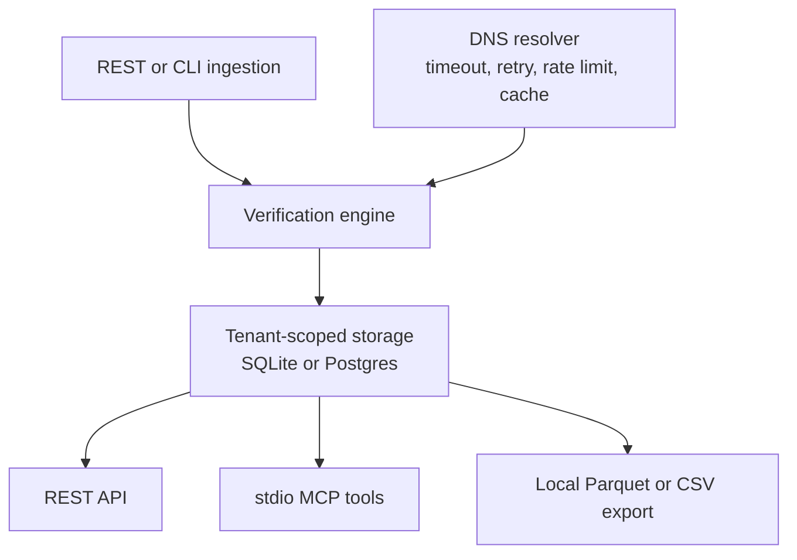

# Architecture

<!-- sourcebound:purpose -->
Use this page to trace one tenant-scoped contact from ingestion to an explainable syntax and DNS result, then through each serving boundary. It identifies where external calls, tenant isolation, and local side effects occur.
<!-- sourcebound:end purpose -->

Diagram: REST or CLI ingestion sends a tenant's contacts through syntax checks and bounded DNS
lookups, then into tenant-scoped storage. REST, stdio MCP tools, and local exports read the same
stored records.

## Layers

- **`api/`** validates input, resolves the tenant, invokes a service or repository method, and
  shapes the response. Injectable sessions and verifiers keep network work out of tests.
- **`services.py`** owns the verify-and-deduplicate use case shared by HTTP, CLI, and MCP callers.
- **`db/`** owns the models and tenant-scoped repository. No contact query omits a tenant ID.
- **`verify/`** normalizes syntax, gathers DNS routing evidence, and maps that evidence to a
  compatibility status and ordinal rule score.
- **`export.py` and `mcp/`** expose stored records through local export and stdio tool boundaries.

## DNS boundary

`verify/dns.py` is the only external call in the verification path. The client contains four
failure controls:

- A timeout bounds each attempt.
- Exponential backoff and jitter retry only transient timeouts and resolver failures. `NXDOMAIN`
  returns immediately because retrying a definitive answer changes nothing.
- A client-side rate limit paces a bulk assessment.
- A size-bounded LRU cache keeps repeated domain lookups finite. Transient failures are not cached.

No MX answer triggers A and AAAA lookups because SMTP permits an implicit route through the address
record. Null MX, `NXDOMAIN`, and a domain with no MX/A/AAAA route are definitive negative states.
A transient failure remains `transient` and maps to `risky`; the service does not turn resolver
uncertainty into a mailbox claim.

## Storage and tenant isolation

SQLite is the default; `CV_DATABASE_URL` can select Postgres. Alembic owns schema migrations, while
the local SQLite path supports `create_all` for a service-free start. Indexes cover tenant listing
and tenant-local normalized-email deduplication.

API keys resolve to one tenant. Every repository method includes that tenant in its query. REST
returns 404 for another tenant's contact. A separate MCP negative test proves that one tenant's key
cannot list or fetch another tenant's contact while the owning key can.

## Security and privacy

- API keys are random and stored only as SHA-256 hashes; plaintext appears once.
- Configuration and DSNs come from the environment or a gitignored `.env` file.
- Committed fixtures use synthetic contacts; local operator data stays outside version control.
- SQLAlchemy parameterizes database queries.
- Sentry is disabled unless a DSN is configured and uses `send_default_pii=False`.

## Declared limits

This repository provides a local service, not a hosted verification platform. Verification runs
inline; there is no worker queue or third-party enrichment API. Authentication stops at tenant API
keys. Exports write to the local filesystem rather than S3 or a warehouse stage. Syntax and DNS
routing evidence cannot establish mailbox existence, delivery, identity, consent, or permission.
